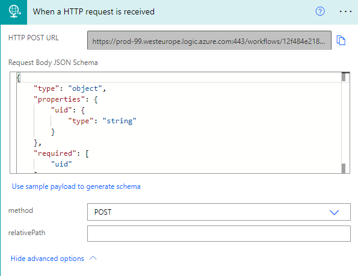
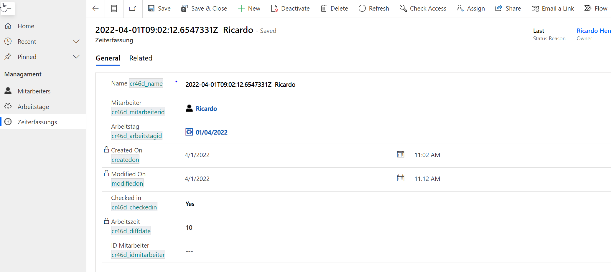
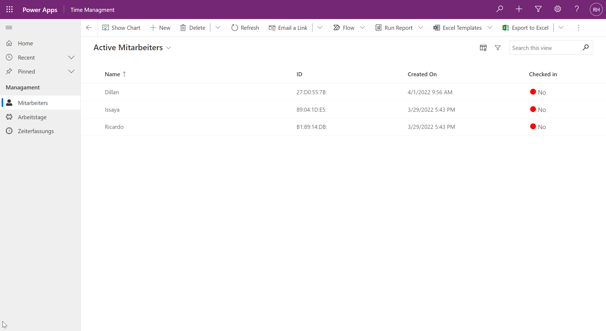
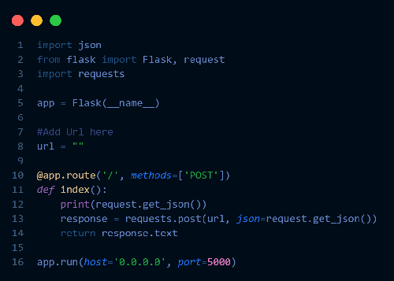

# Time Management System

An employee signs in or out and the program creates a new record on the CRM (Dynamics 365) which contains the data from the card. The data is summarized in a working day and additionally assigned to an employee. All these processes are controlled in the background via several flows so that everything works automatically. Each day a new workday is created for the employees and the day is also created as soon as a new employee logs in for the first time.

## Getting Started

### Prerequisites

* Ubuntu 20.04.4 LTS
  * Python 3 installed
  * Python3-pip installed
  * Screen installed

### Installation

1. Import project
```
https://github.com/drums1706/time-management-system.git
```
2. Change the Wi-Fi password and username in `mbed_app.json`.


3. Compile the cpp files and upload them to your IoTkit.

### Power Apps / Automate

1. Add a condition to receive body from iotkit.  


2. Create a form by using this: 
[Tutorial](https://www.youtube.com/watch?v=b9S-hvlG7AU)

3. Call your Microsoft Flow from your application by following this: 
[Call Flow from your application](https://powerautomate.microsoft.com/en-us/blog/call-flow-restapi/)

4. Add a row in Dataverse, by following this Website: 
[Add row to Dataverse](https://docs.microsoft.com/en-us/power-automate/dataverse/create)

In the end it should look something like this:  
Datarow:   
  

Overview:   


### Python relay deployment

1. Connect to the linux machine / server.

2. Import the project.
```
https://github.com/drums1706/time-management-system.git
```

3. Open the `relay` folder.

4. Install the dependencies:
```
pip3 install flask requests
```

5. Change the url to your Azure Cloud url.  


6. Run the relay script:

Option A: Run it as long as your terminal is open:
```
python3 relay.py
```

Option B: Run it in the background, without the terminal being open all the time:
```
screen -dmS python-relay python3 relay.py
```
This will start a separate session with the name `python-relay`.
* To interact with the session, use `screen -r python-relay`
* To exit from the sesison, use `CTRL` + `A` + `D` or `CTRL` + `C` to exit and kill


## Documentation

### Reflection

The project was very interessting and we learned alot from this modul. We learned what an iotkit is an what its able to do. The most interessting and challenging part of the whole project was, that we had to do a Https post request to a server. But the most fun part to do was to implement the RFID reader. Many challenges stood before us, but we managed to conqueror them. The Learning experience was exponential for us, because we didn't know anything when we started this modul. But as time passed, we got to learn so many different things and many possibilitys to do with the iotkit. 

### Use HTTPS

We wanted to make a Https POST request to our Azure server but quickly realized, that this wasn't possible, because the version of the request wasn't supported. So we had to think of another way to make the request. We later came up with an idea to make a relay to the Azure database. We used Python 3 and the package called flask to accept http requests and forward them as https to Azure, by using the package called requests.

### Cloud

We used Azure to store and visualize our data. But to host the python relay, we used a server (own cloud) from our friend Dillan.

## Knowledgebase

#### RFID Scanner:  
An RFID scanner is a contactless Datatransporter between a RFID-Transponder and a RFID-read/writer. The scanner uses electromagnetic or magnetic fields to transfer the data.

#### iotkitv3:  
An iotkitv3 is an open-source electronics platform based on easy-to-use hardware and software.

#### Power Apps:  
Power Apps is a suite of apps, services, and connectors, as well as a data platform, that provides a rapid development environment to build custom apps for your business needs.

#### Power Automate:  
Power Automate, formerly Microsoft Flow, is an online tool within the Microsoft 365 applications and add-ins, used for the creation of automated workflows between apps and services to synchronize files, get notifications, and collect data.

#### Cloud Services:  
The term "cloud services" refers to a wide range of services delivered on demand to companies and customers over the internet. These services are designed to provide easy, affordable access to applications and resources, without the need for internal infrastructure or hardware.