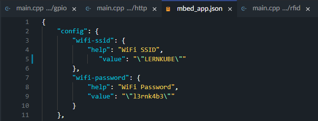

# Time Management System

A short description about the project and/or client.

## Getting Started

### Prerequisites

* Ubuntu 20.04.4 LTS
  * Python 3 installed
  * Python3-pip installed
  * Screen installed

### Installation

1. Import project
```
https://github.com/drums1706/time-management-system.git
```
2. Change the Wi-Fi password and username in `mbed_app.json`.


3. Compile the cpp files and upload them to your IoTkit.

### Python relay deployment

1. Connect to the linux machine / server.

2. Import the project.
```
https://github.com/drums1706/time-management-system.git
```

3. Open the `relay` folder.

4. Install the dependencies:
```
pip3 install flask requests
```

5. Run the relay script:

Option A: Run it as long as your terminal is open:
```
python3 relay.py
```

Option B: Run it in the background, without the terminal being open all the time:
```
screen -dmS python-relay -c python3 relay.py
```

## Additional Documentation and Acknowledgments

...
